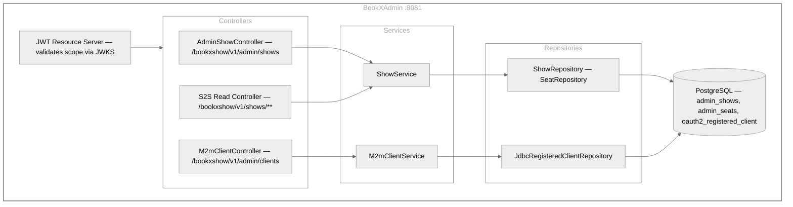
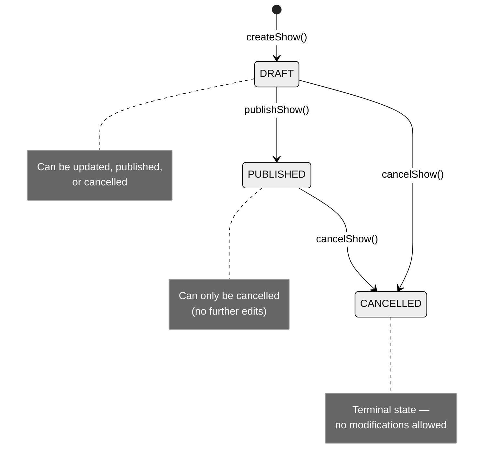

# BookXAdmin — Admin Service

Show administration microservice (Spring Boot 3.2.3, Java 21) providing:
- **Master show and seat management** — full lifecycle from DRAFT → PUBLISHED → CANCELLED
- **OAuth2 M2M client CRUD** — create, update, and delete `client_credentials` clients at runtime
- **S2S read API** — consumed by BookXShow to sync show/seat data

Acts as an OAuth2 Resource Server — all requests require a valid JWT Bearer token issued by the Auth Server.

- **Port:** `8081` (env: `SERVER_PORT`)
- **Base package:** `com.bookxshow.admin`
- **Database:** PostgreSQL `bookingDb` — tables `admin_shows`, `admin_seats`, `oauth2_registered_client`
- **Test coverage:** 90% instruction, 80% branch minimum (JaCoCo)

---

## Table of Contents

- [Architecture](#architecture)
- [Show Lifecycle](#show-lifecycle)
- [Seat Auto-Generation](#seat-auto-generation)
- [API Endpoints](#api-endpoints)
- [Security](#security)
- [Configuration](#configuration)
- [Running Locally](#running-locally)
- [Docker](#docker)
- [Testing](#testing)

---

## Architecture



Also exposes S2S read endpoints at `/bookxshow/v1/shows/**` consumed by BookXShow.

---

## Show Lifecycle



- **DRAFT** shows can be updated, published, or cancelled.
- **PUBLISHED** shows can only be cancelled (no edits).
- **CANCELLED** shows cannot be modified.

---

## Seat Auto-Generation

When a show is created, seats are automatically generated based on `totalSeats`:

- Arranged in **rows of 20**: A01–A20, B01–B20, C01–C20, …
- Row labels: **A–Z** (supports up to 520 seats per show, max 10,000)
- All auto-generated seats default to **STANDARD** category at the show's `basePrice`
- Categories: `STANDARD`, `PREMIUM`, `VIP`

---

## API Endpoints

### Admin Show Management (`/bookxshow/v1/admin/shows`)

| Method | Path | Scope | Description |
|--------|------|-------|-------------|
| `POST` | `/bookxshow/v1/admin/shows` | `bookxshow.write` | Create a show (starts in DRAFT, auto-generates seats) |
| `GET` | `/bookxshow/v1/admin/shows` | `bookxshow.read` | List all shows (ordered by date desc) |
| `GET` | `/bookxshow/v1/admin/shows/{showId}` | `bookxshow.read` | Get show by internal ID |
| `PUT` | `/bookxshow/v1/admin/shows/{showId}` | `bookxshow.write` | Update show metadata (partial, DRAFT only) |
| `POST` | `/bookxshow/v1/admin/shows/{showId}/publish` | `bookxshow.write` | Transition DRAFT → PUBLISHED |
| `DELETE` | `/bookxshow/v1/admin/shows/{showId}` | `bookxshow.write` | Cancel a show (DRAFT or PUBLISHED → CANCELLED) |
| `GET` | `/bookxshow/v1/admin/shows/{showId}/seats` | `bookxshow.read` | List all seats for a show |

**Create show request:**
```json
{
  "name": "The Grand Musical",
  "venue": "City Opera House",
  "showDateTime": "2026-06-15T19:30:00",
  "totalSeats": 100,
  "basePrice": 499.99
}
```

### M2M Client Management (`/bookxshow/v1/admin/clients`) — requires `bookxshow.admin`

| Method | Path | Description |
|--------|------|-------------|
| `POST` | `/bookxshow/v1/admin/clients` | Register a new OAuth2 client (client_credentials) |
| `GET` | `/bookxshow/v1/admin/clients` | List all registered M2M clients |
| `GET` | `/bookxshow/v1/admin/clients/{clientId}` | Get client details |
| `PUT` | `/bookxshow/v1/admin/clients/{clientId}` | Update name, secret (rotation), scopes, TTL |
| `DELETE` | `/bookxshow/v1/admin/clients/{clientId}` | Delete a client |

**Create client request:**
```json
{
  "clientId": "my-service",
  "clientSecret": "supersecret123",
  "clientName": "My Integration Service",
  "scopes": ["bookxshow.read"],
  "accessTokenTtlMinutes": 60
}
```

⚠️ Client responses never include the secret. Rotate by sending `PUT` with a new `clientSecret`.

### S2S Read Endpoints (consumed by BookXShow)

| Method | Path | Scope | Description |
|--------|------|-------|-------------|
| `GET` | `/bookxshow/v1/shows/{externalShowId}` | `bookxshow.read` | Get show metadata by external ID |
| `GET` | `/bookxshow/v1/shows/{externalShowId}/seats` | `bookxshow.read` | List seats by external show ID |

---

## Security

- Stateless JWT validation via Auth Server's JWKS endpoint
- CSRF disabled (stateless API)
- Scope-based authorization per endpoint:

| Path | Required Scope / Role |
|------|-----------------------|
| `GET /bookxshow/v1/shows/**` | `SCOPE_bookxshow.read` |
| `GET /bookxshow/v1/admin/**` | `SCOPE_bookxshow.read` |
| `POST/PUT/DELETE /bookxshow/v1/admin/**` | `SCOPE_bookxshow.write` |
| `/bookxshow/v1/admin/clients/**` | `SCOPE_bookxshow.admin` |
| `/actuator/health`, `/actuator/info` | Public |

---

## Configuration

| Environment Variable | Default | Description |
|---------------------|---------|-------------|
| `SERVER_PORT` | `8081` | Server port |
| `DB_URL` | `jdbc:postgresql://localhost:5432/bookingDb` | PostgreSQL JDBC URL |
| `DB_USERNAME` | `bookxshow` | Database username |
| `DB_PASSWORD` | `12345678` | Database password |
| `AUTH_SERVER_ISSUER_URI` | `http://localhost:9000` | Auth Server for JWT validation via JWKS |
| `JPA_DDL_AUTO` | `update` | Hibernate DDL mode |

---

## Running Locally

### Prerequisites

- Java 21
- PostgreSQL 15+ running on `localhost:5432` with database `bookingDb`
- BookXAuthServer running on `:9000`

```bash
cd BookXAdmin

# Run with default profile
./gradlew bootRun

# Or with local profile
./gradlew bootRunLocal
```

Service starts at **http://localhost:8081**.

Verify health: `curl http://localhost:8081/actuator/health`

---

## Docker

### Build Image

```bash
cd BookXAdmin
docker build -t bookx-admin:latest .
```

### Run Container

```bash
docker run -d -p 8081:8081 \
  --name bookx-admin \
  -e DB_URL=jdbc:postgresql://host.docker.internal:5432/bookingDb \
  -e DB_USERNAME=bookxshow \
  -e DB_PASSWORD=12345678 \
  -e AUTH_SERVER_ISSUER_URI=http://localhost:9000 \
  bookx-admin:latest
```

### Dockerfile Highlights

| Feature | Detail |
|---------|--------|
| Build image | `eclipse-temurin:21-jdk-alpine` |
| Runtime image | `eclipse-temurin:21-jre-alpine` |
| Non-root user | `bookxshow` |
| Health check | `GET /actuator/health` every 30 s |
| JVM flags | Container-aware (`-XX:+UseContainerSupport`, `MaxRAMPercentage=75`) |

---

## Testing

```bash
# Unit tests only
./gradlew test

# Integration tests only  
./gradlew integrationTest

# All tests + coverage check (fails if below threshold)
./gradlew check
```

| Test Suite | Location | Coverage Minimum |
|-----------|---------|-----------------|
| Unit tests | `src/test/` | — |
| Integration tests | `src/integrationTest/` | 90% instruction, 80% branch |

### What's tested

- **Unit:** `ShowServiceImplTest` (20+ cases), `M2mClientServiceImplTest` (15+ cases), all controller tests with MockMvc, `GlobalExceptionHandlerTest`
- **Integration:** `AdminShowIntegrationIT` (14 lifecycle tests), `M2mClientIntegrationIT` (10 tests including secret rotation, 409 duplicate checks) — all with H2 in-memory database

Test reports: `build/reports/tests/test/index.html` and `build/reports/tests/integrationTest/index.html`

JaCoCo HTML coverage report: `build/reports/jacoco/test/html/index.html`
