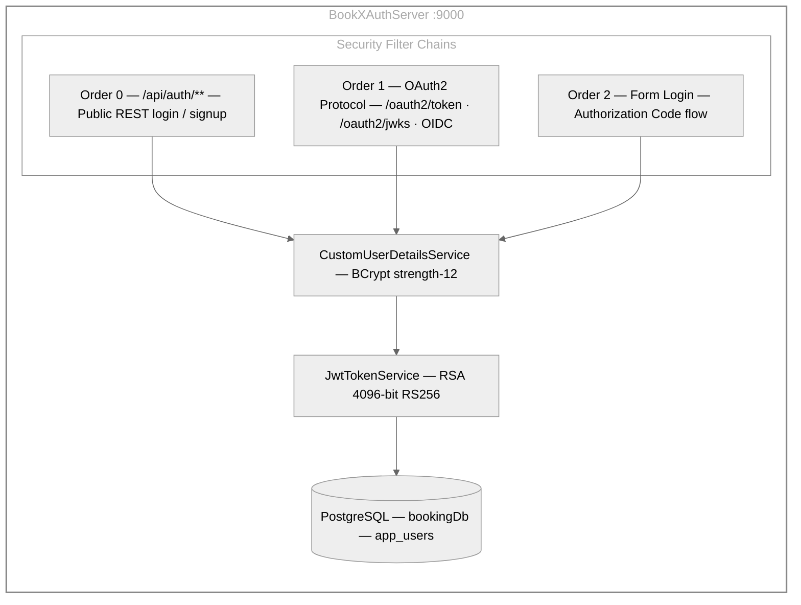

# BookXAuthServer — Spring Authorization Server

Spring Authorization Server (Spring Boot 3.2.3, Java 21) that issues RSA-signed JWT tokens for the entire BookX platform. Acts as the identity provider for all services.

- **Port:** `9000` (env: `AUTH_SERVER_PORT`)
- **Base package:** `com.bookxshow.authserver`
- **JWT signing:** RSA 4096-bit key pair, RS256 algorithm
- **Password encoding:** BCrypt strength 12
- **Database:** PostgreSQL `bookingDb` — `app_users` table

---

## Table of Contents

- [Architecture](#architecture)
- [Security Filter Chains](#security-filter-chains)
- [OAuth2 Clients](#oauth2-clients)
- [API Endpoints](#api-endpoints)
- [Auth Flows](#auth-flows)
- [Configuration](#configuration)
- [Running Locally](#running-locally)
- [Docker](#docker)
- [Testing](#testing)

---

## Architecture



---

## Security Filter Chains

Three ordered security filter chains handle different access patterns:

| Order | Matcher | Purpose |
|-------|---------|---------|
| `0` | `/api/auth/**` | Public REST login/signup. Stateless, no auth required. |
| `1` | OAuth2 protocol endpoints | `/oauth2/token`, `/oauth2/authorize`, `/oauth2/jwks`, OIDC endpoints. |
| `2` | Everything else | Default form login for Authorization Code flow. Actuator health/info public. |

---

## OAuth2 Clients

Three OAuth2 clients are pre-registered:

| Client ID | Grant Type | Scopes | TTL | Purpose |
|-----------|-----------|--------|-----|---------|
| `bookxshow-gateway` | `authorization_code` + `refresh_token` | openid, profile, bookxshow.read, bookxshow.write | Access: 60 min, Refresh: 8 h | Browser users via Gateway |
| `bookxshow-m2m` | `client_credentials` | bookxshow.read, bookxshow.write | Access: 60 min | API clients / Postman |
| `bookxshow-service` | `client_credentials` | bookxshow.read, bookxshow.write | Access: 15 min | Service-to-service (BookXShow → AdminService) |

---

## API Endpoints

### Public REST API (`/api/auth`)

| Method | Path | Description | Response |
|--------|------|-------------|----------|
| `POST` | `/api/auth/signup` | Register a new user | `201` AuthResponse |
| `POST` | `/api/auth/login` | Login with credentials | `200` AuthResponse |

**Signup request:**
```json
{
  "username": "alice",
  "email": "alice@example.com",
  "password": "password123"
}
```

**Login request:**
```json
{
  "username": "alice",
  "password": "password123"
}
```

**AuthResponse:**
```json
{
  "access_token": "<jwt>",
  "token_type": "Bearer",
  "expires_in": 3600,
  "username": "alice",
  "email": "alice@example.com",
  "roles": "ROLE_USER"
}
```

### OAuth2 / OIDC Endpoints (standard)

| Endpoint | Description |
|----------|-------------|
| `POST /oauth2/token` | Token endpoint (client_credentials / authorization_code) |
| `GET /oauth2/authorize` | Authorization endpoint |
| `GET /oauth2/jwks` | JSON Web Key Set (public key for JWT validation) |
| `GET /.well-known/openid-configuration` | OIDC discovery document |
| `GET /actuator/health` | Health check (public) |

---

## Auth Flows

### 1. Direct REST Login (Postman, mobile, SPA)

```bash
# Signup
curl -X POST http://localhost:9000/api/auth/signup \
  -H "Content-Type: application/json" \
  -d '{"username":"alice","email":"alice@example.com","password":"password123"}'

# Login — returns a signed JWT directly
curl -X POST http://localhost:9000/api/auth/login \
  -H "Content-Type: application/json" \
  -d '{"username":"alice","password":"password123"}'
```

### 2. M2M Client Credentials

```bash
curl -X POST http://localhost:9000/oauth2/token \
  -u "bookxshow-m2m:m2m-secret" \
  -d "grant_type=client_credentials" \
  -d "scope=bookxshow.read bookxshow.write"
```

### 3. Authorization Code (via Gateway — browser users)

The Gateway handles this flow automatically. The browser is redirected to `http://localhost:9000/login`, the user logs in, and the Gateway relays the token downstream.

---

## JWT Claims

All issued tokens contain:

| Claim | Description |
|-------|-------------|
| `sub` | Username |
| `scope` | `bookxshow.read bookxshow.write` (+ `bookxshow.admin` for ROLE_ADMIN) |
| `roles` | User roles (e.g. `ROLE_USER`) |
| `email` | User email |
| `userId` | Internal user ID |
| `iss` | Issuer URI |
| `iat` / `exp` | Issued at / expiry |

---

## Configuration

All properties are in `src/main/resources/application.yaml` with environment variable overrides.

| Environment Variable | Default | Description |
|---------------------|---------|-------------|
| `AUTH_SERVER_PORT` | `9000` | Server port |
| `DB_URL` | `jdbc:postgresql://localhost:5432/bookingDb` | PostgreSQL JDBC URL |
| `DB_USERNAME` | `bookxshow` | Database username |
| `DB_PASSWORD` | `12345678` | Database password |
| `AUTH_ISSUER_URI` | `http://localhost:9000` | JWT issuer URI (must match resource server config) |
| `ACCESS_TOKEN_TTL_MINUTES` | `60` | Access token lifetime |
| `REFRESH_TOKEN_TTL_HOURS` | `8` | Refresh token lifetime |
| `GATEWAY_CLIENT_SECRET` | `gateway-secret` | Secret for `bookxshow-gateway` client |
| `SERVICE_CLIENT_SECRET` | `service-secret` | Secret for `bookxshow-service` client |
| `M2M_CLIENT_SECRET` | `m2m-secret` | Secret for `bookxshow-m2m` client |
| `GATEWAY_REDIRECT_URI` | `http://localhost:8443/login/oauth2/code/bookxshow-auth-server` | OAuth2 redirect URI |
| `GATEWAY_POST_LOGOUT_URI` | `http://localhost:8443/` | Post-logout redirect |

---

## Running Locally

### Prerequisites

- Java 21
- PostgreSQL 15+ running on `localhost:5432` with database `bookingDb`

### Build and Run

```bash
cd BookXAuthServer

# Run with default (local) profile
./gradlew bootRun

# Or explicitly with local profile
./gradlew bootRunLocal
```

Service starts at **http://localhost:9000**.

Verify health: `curl http://localhost:9000/actuator/health`

---

## Docker

### Build Image

```bash
cd BookXAuthServer
docker build -t bookx-auth-server:latest .
```

### Run Container

```bash
docker run -d -p 9000:9000 \
  --name bookx-auth-server \
  -e DB_URL=jdbc:postgresql://host.docker.internal:5432/bookingDb \
  -e DB_USERNAME=bookxshow \
  -e DB_PASSWORD=12345678 \
  -e AUTH_ISSUER_URI=http://localhost:9000 \
  bookx-auth-server:latest
```

### Dockerfile Highlights

| Feature | Detail |
|---------|--------|
| Build image | `eclipse-temurin:21-jdk-alpine` |
| Runtime image | `eclipse-temurin:21-jre-alpine` |
| Non-root user | `bookxshow` |
| Health check | `GET /actuator/health` every 30 s |
| JVM flags | Container-aware (`-XX:+UseContainerSupport`, `MaxRAMPercentage=75`) |

---

## Testing

```bash
# Unit tests
./gradlew test

# All checks
./gradlew check
```

Test reports: `build/reports/tests/test/index.html`

Unit tests cover `AuthController`, `CustomUserDetailsService`, and `JwtTokenService`. Tests use H2 in-memory database with the `test` profile (JWT validation disabled).
