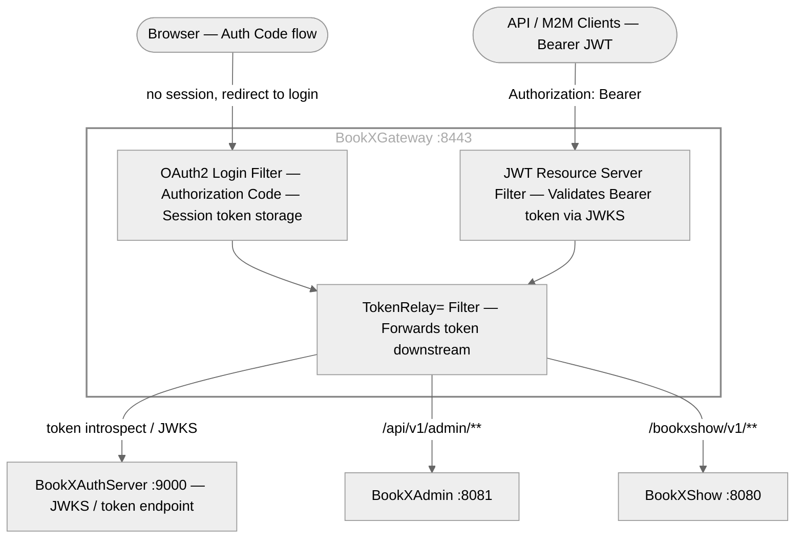

# BookXGateway — API Gateway

Spring Cloud Gateway (Spring Boot 3.2.3, Spring Cloud 2023.0.0, Java 21) — reactive WebFlux-based API gateway. Acts as the **single entry point** for all external traffic. Handles OAuth2 authentication for browser users and JWT validation for API/M2M clients, then relays tokens to downstream services.

- **Port:** `8443` (env: `GATEWAY_PORT`)
- **Base package:** `com.bookxshow.gateway`
- **Runtime:** Reactive (Netty / WebFlux)

---

## Table of Contents

- [Architecture](#architecture)
- [Security Model](#security-model)
- [Route Configuration](#route-configuration)
- [Auth Flows](#auth-flows)
- [Configuration](#configuration)
- [Running Locally](#running-locally)
- [Docker](#docker)
- [Testing](#testing)

---

## Architecture



---

## Security Model

The Gateway uses two parallel security mechanisms:

| Mechanism | Trigger | Use Case |
|-----------|---------|---------|
| **OAuth2 Login** (Authorization Code) | Browser requests without a token | Redirects to Auth Server login form; stores token in session |
| **JWT Resource Server** | Requests with `Authorization: Bearer <token>` | Validates the JWT against the Auth Server's JWKS endpoint |

**Always public (no auth required):**
- `GET /actuator/health`
- `GET /actuator/info`
- `OPTIONS /**` (CORS preflight)
- `/api/auth/**` (login/signup passthrough)
- `POST /oauth2/token` (M2M token endpoint)

All other paths require authentication.

---

## Route Configuration

| Route ID | Path Pattern | Downstream | Purpose |
|----------|-------------|-----------|---------|
| `bookxshow-booking-service` | `/bookxshow/v1/bookings/**`, `/bookxshow/v1/shows/**` | `booking-service:8080` | Booking & seat APIs |
| `bookxshow-admin-sync` | `/bookxshow/v1/admin/**` | `booking-service:8080` | Admin sync endpoint |
| `bookxshow-admin-service` | `/api/v1/admin/**` | `admin-service:8081` | Admin Service APIs |
| `bookxshow-payment-service` | `/api/v1/payments/**` | `payment-service:8082` | Payment Service (future) |
| `bookxshow-auth-api` | `/api/auth/**` | `auth-server:9000` | Public login/signup |
| `bookxshow-oauth2-token` | `/oauth2/token` | `auth-server:9000` | M2M token endpoint |

Default filter on all routes: `TokenRelay=` — relays the OAuth2 access token to the downstream service as a `Bearer` header.

---

## Auth Flows

### Browser / UI Users (Authorization Code)

```
1. Browser → GET http://localhost:8443/bookxshow/v1/shows/...
2. Gateway detects no session → sends 302 to /oauth2/authorization/bookxshow-auth-server
3. Browser follows redirect to Auth Server :9000/login
4. User enters credentials → Auth Server issues authorization code
5. Browser follows redirect back to Gateway /login/oauth2/code/bookxshow-auth-server
6. Gateway exchanges code for JWT, stores in session
7. Subsequent requests → TokenRelay forwards JWT to downstream services
```

### API / M2M Clients (Client Credentials)

```bash
# Step 1 — Get token from Auth Server directly
TOKEN=$(curl -s -X POST http://localhost:9000/oauth2/token \
  -u "bookxshow-m2m:m2m-secret" \
  -d "grant_type=client_credentials" \
  -d "scope=bookxshow.read bookxshow.write" | jq -r .access_token)

# Step 2 — Call Gateway with Bearer token (token is relayed to downstream)
curl -H "Authorization: Bearer $TOKEN" \
  http://localhost:8443/bookxshow/v1/shows/1/seats

curl -X POST http://localhost:8443/bookxshow/v1/bookings \
  -H "Authorization: Bearer $TOKEN" \
  -H "Content-Type: application/json" \
  -d '{"showId": 1, "seatId": 5, "userId": "user-123", "amount": 499.99}'
```

### Login via REST (direct JWT)

```bash
# Returns a JWT you can use as a Bearer token directly
curl -X POST http://localhost:8443/api/auth/login \
  -H "Content-Type: application/json" \
  -d '{"username":"alice","password":"password123"}'
```

---

## Configuration

| Environment Variable | Default | Description |
|---------------------|---------|-------------|
| `GATEWAY_PORT` | `8443` | Server port |
| `AUTH_SERVER_ISSUER_URI` | `http://localhost:9000` | Auth Server URL for JWKS + OIDC discovery |
| `AUTH_SERVER_URL` | `http://localhost:9000` | Auth Server URL for route forwarding |
| `GATEWAY_CLIENT_SECRET` | `gateway-secret` | OAuth2 client secret for `bookxshow-gateway` |
| `BOOKING_SERVICE_URL` | `http://localhost:8080` | Booking service upstream URL |
| `ADMIN_SERVICE_URL` | `http://localhost:8081` | Admin service upstream URL |
| `PAYMENT_SERVICE_URL` | `http://localhost:8082` | Payment service upstream URL (future) |

---

## Running Locally

### Prerequisites

- Java 21
- BookXAuthServer running on `:9000`

```bash
cd BookXGateway
./gradlew bootRun

# Or explicitly with local profile
./gradlew bootRunLocal
```

Service starts at **http://localhost:8443**.

Verify health: `curl http://localhost:8443/actuator/health`

Browser test: Open `http://localhost:8443/bookxshow/v1/shows/1/seats` — you'll be redirected to the Auth Server login page.

---

## Docker

### Build Image

```bash
cd BookXGateway
docker build -t bookx-gateway:latest .
```

### Run Container

```bash
docker run -d -p 8443:8443 \
  --name bookx-gateway \
  -e AUTH_SERVER_ISSUER_URI=http://auth-server:9000 \
  -e GATEWAY_CLIENT_SECRET=gateway-secret \
  -e BOOKING_SERVICE_URL=http://booking-service:8080 \
  -e ADMIN_SERVICE_URL=http://admin-service:8081 \
  bookx-gateway:latest
```

### Dockerfile Highlights

| Feature | Detail |
|---------|--------|
| Build image | `eclipse-temurin:21-jdk-alpine` |
| Runtime image | `eclipse-temurin:21-jre-alpine` |
| Non-root user | `bookxshow` |
| Health check | `GET /actuator/health` every 30 s |
| JVM flags | Container-aware (`-XX:+UseContainerSupport`, `MaxRAMPercentage=75`) |

---

## Testing

```bash
# Unit tests
./gradlew test

# All checks
./gradlew check
```

Tests use `spring-security-test` for mocking OAuth2 sessions and JWT tokens in the reactive (WebFlux) test context.
