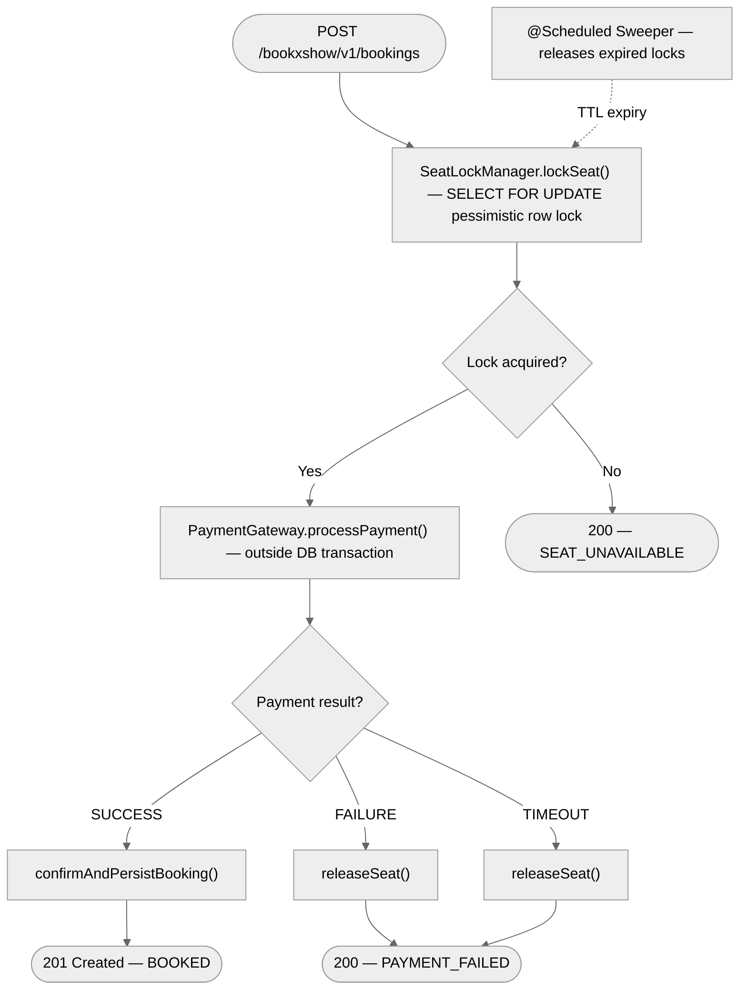
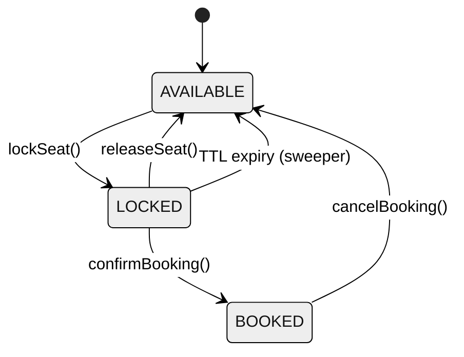

# BookXShow — Seat Booking Service

Spring Boot microservice (3.2.3, Java 21) implementing the core seat booking flow: **lock → pay → confirm**. Acts as an OAuth2 Resource Server — all API access requires a valid JWT Bearer token issued by the Auth Server.

- **Port:** `8080` (env: `SERVER_PORT`)
- **Base package:** `com.bookxshow`
- **Database:** PostgreSQL `bookingDb` — tables `shows`, `seats`, `bookings`
- **Test coverage:** 92% instruction, 84% branch minimum (JaCoCo)

---

## Table of Contents

- [Booking Flow](#booking-flow)
- [Seat Lifecycle](#seat-lifecycle)
- [API Endpoints](#api-endpoints)
- [Security](#security)
- [Configuration](#configuration)
- [Running Locally](#running-locally)
- [Docker](#docker)
- [Testing](#testing)
- [Design Patterns](#design-patterns)

---

## Booking Flow



---

## Seat Lifecycle



---

## API Endpoints

All paths are routed through the Gateway at `:8443`.

| Method | Path | Scope | Description |
|--------|------|-------|-------------|
| `POST` | `/bookxshow/v1/bookings` | `bookxshow.write` | Book a seat (lock -> pay -> confirm) |
| `GET` | `/bookxshow/v1/bookings/{ref}` | `bookxshow.read` | Get booking by reference |
| `DELETE` | `/bookxshow/v1/bookings/{ref}` | `bookxshow.write` | Cancel a booking (owner or admin only) |
| `GET` | `/bookxshow/v1/shows/{showId}/seats` | `bookxshow.read` | List all seats and their status |
| `GET` | `/bookxshow/v1/shows/{showId}/seats/{seatId}` | `bookxshow.read` | Get a single seat's current status |
| `GET` | `/bookxshow/v1/users/{userId}/bookings` | `bookxshow.read` | Booking history for a user |
| `POST` | `/bookxshow/v1/admin/shows/{externalShowId}/sync` | `bookxshow.write` | Sync show and seats from Admin Service |
| `GET` | `/actuator/health` | Public | Health check |

**Book a seat request:**
```json
{
  "showId": 1,
  "seatId": 5,
  "userId": "user-abc123",
  "amount": 499.99
}
```

**Booking response:**
```json
{
  "bookingReference": "BXS-a1b2c3d4",
  "seatId": 5,
  "seatNumber": "A05",
  "showId": 1,
  "userId": "user-abc123",
  "outcome": "BOOKED",
  "seatStatus": "BOOKED"
}
```

**Possible outcomes:** `BOOKED`, `SEAT_UNAVAILABLE`, `PAYMENT_FAILED`, `LOCK_EXPIRED`, `ALREADY_BOOKED`, `CANCELLED`

---

## Security

- Stateless JWT validation via Auth Server JWKS endpoint
- CSRF disabled (stateless API)
- `@PreAuthorize` on cancel booking — only booking owner or `ROLE_ADMIN` can cancel

| Path | Required Scope |
|------|----------------|
| `GET` paths | `SCOPE_bookxshow.read` |
| `POST`, `DELETE` paths | `SCOPE_bookxshow.write` |
| `/actuator/health`, `/actuator/info` | Public |

---

## Configuration

| Environment Variable | Default | Description |
|---------------------|---------|-------------|
| `SERVER_PORT` | `8080` | Server port |
| `DB_URL` | `jdbc:postgresql://localhost:5432/bookingDb` | PostgreSQL JDBC URL |
| `DB_USERNAME` | `bookxshow` | Database username |
| `DB_PASSWORD` | `12345678` | Database password |
| `AUTH_SERVER_ISSUER_URI` | `http://localhost:9000` | Auth Server for JWT validation |
| `AUTH_TOKEN_URL` | `http://localhost:9000/oauth2/token` | Token endpoint for outbound calls |
| `AUTH_CLIENT_ID` | `bookxshow-service` | Service client ID |
| `AUTH_CLIENT_SECRET` | `service-secret` | Service client secret |
| `AUTH_SCOPE` | `bookxshow.read bookxshow.write` | Scopes for outbound tokens |
| `ADMIN_SERVICE_URL` | `http://localhost:8081` | Admin Service base URL |
| `PAYMENT_GATEWAY_URL` | `http://localhost:8082` | Payment service URL |
| `SEAT_LOCK_TTL_MS` | `30000` | Seat lock timeout in milliseconds |
| `LOCK_SWEEP_INTERVAL_MS` | `60000` | Expired lock sweeper interval |

---

## Running Locally

### Prerequisites

- Java 21
- PostgreSQL 15+ on `localhost:5432` with database `bookingDb`
- BookXAuthServer running on `:9000`
- BookXAdmin running on `:8081`

```bash
cd BookXShow
./gradlew bootRun

# Or with local profile
./gradlew bootRunLocal
```

Service starts at **http://localhost:8080**.
Verify: `curl http://localhost:8080/actuator/health`

---

## Docker

### Build Image

```bash
cd BookXShow
docker build -t bookx-show:latest .
```

### Run Container

```bash
docker run -d -p 8080:8080 \
  -e DB_URL=jdbc:postgresql://host.docker.internal:5432/bookingDb \
  -e DB_USERNAME=bookxshow \
  -e DB_PASSWORD=12345678 \
  -e AUTH_SERVER_ISSUER_URI=http://localhost:9000 \
  -e AUTH_TOKEN_URL=http://localhost:9000/oauth2/token \
  -e AUTH_CLIENT_ID=bookxshow-service \
  -e AUTH_CLIENT_SECRET=service-secret \
  -e ADMIN_SERVICE_URL=http://localhost:8081 \
  bookx-show:latest
```

### Dockerfile Highlights

| Feature | Detail |
|---------|--------|
| Build image | `eclipse-temurin:21-jdk-alpine` |
| Runtime image | `eclipse-temurin:21-jre-alpine` |
| Non-root user | `bookxshow` |
| Health check | `GET /actuator/health` every 30 s |
| JVM flags | Container-aware (`-XX:+UseContainerSupport`, `MaxRAMPercentage=75`) |
| Layer caching | Gradle deps cached; only source changes trigger rebuild |

---

## Testing

```bash
# Unit tests only
./gradlew test

# Integration tests only
./gradlew integrationTest

# All tests + coverage check (fails if below threshold)
./gradlew check
```

| Test Suite | Location | Coverage Minimum |
|-----------|---------|-----------------|
| Unit tests | `src/test/` | — |
| Integration tests | `src/integrationTest/` | 92% instruction, 84% branch |

Reports: `build/reports/tests/` and `build/reports/jacoco/`

---

## Design Patterns

| Pattern | Where |
|---------|-------|
| **Strategy** | `PaymentGateway` — `StubPaymentGateway` (always SUCCESS) or `RestPaymentGateway` |
| **Adapter** | `AdminServiceClient` — REST calls to Admin Service |
| **Builder** | `BookingResponseDto` — fluent DTO construction |
| **Template Method** | Fixed lock -> pay -> confirm sequence in `BookingServiceImpl` |
| **Externalized Config** | `BookingProperties` — typesafe `@ConfigurationProperties` |
| **Repository** | Spring Data JPA for `Show`, `Seat`, `Booking` |

---

## Database Schema

Auto-generated by Hibernate (`spring.jpa.hibernate.ddl-auto=update`):

| Table | Key Columns |
|-------|-------------|
| `shows` | `id`, `external_show_id` (unique), `name`, `venue`, `show_date_time`, `total_seats` |
| `seats` | `id`, `seat_number`, `show_id` (FK), `status` (AVAILABLE/LOCKED/BOOKED), `locked_by`, `lock_expiry` |
| `bookings` | `id`, `booking_reference` (unique, BXS-...), `seat_id`, `show_id`, `user_id`, `amount`, `status` |