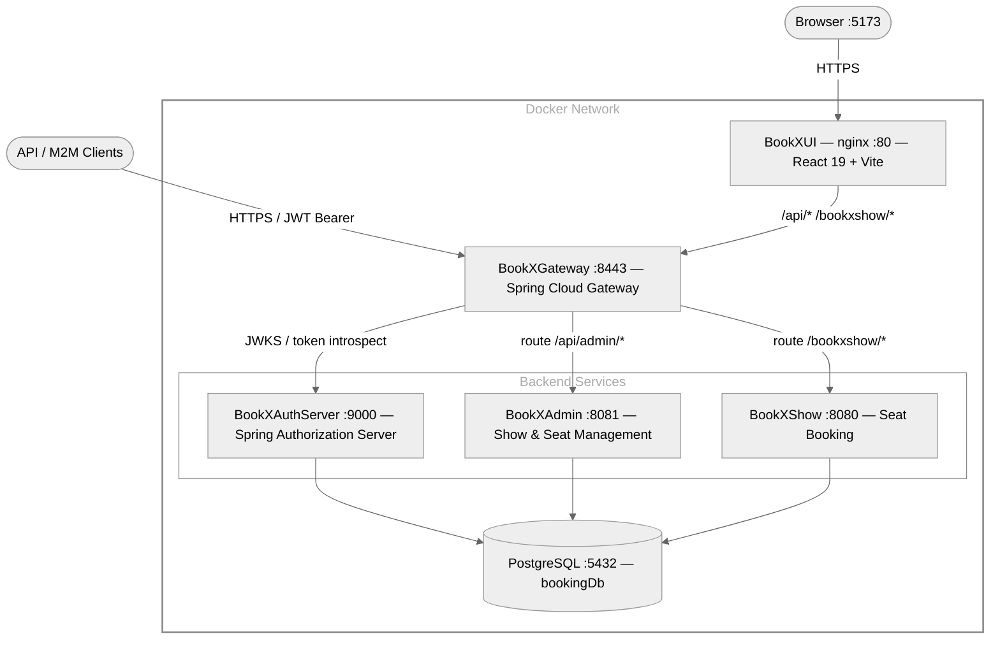

# BookX — Seat Booking Platform

A full-stack, cloud-native seat booking platform built with **Spring Boot 3.2.3**, **Spring Cloud Gateway**, **Spring Authorization Server**, **React 19**, and **PostgreSQL**. All services communicate via OAuth2/JWT and are fully containerised with Docker Compose.

---

## Table of Contents

- [Architecture](#architecture)
- [Services](#services)
- [Boot Order](#boot-order)
- [Prerequisites](#prerequisites)
- [Quick Start — Docker Compose](#quick-start--docker-compose)
- [Quick Start — Local Development](#quick-start--local-development)
- [Root Gradle Build](#root-gradle-build)
- [Project Structure](#project-structure)
- [Environment Variables](#environment-variables)
- [OAuth2 Flows](#oauth2-flows)
- [Service Endpoints](#service-endpoints)
- [Postman Collection](#postman-collection)

---

## Architecture



---

## Services

| # | Service | Port | Technology | Role |
|---|---------|------|-----------|------|
| 0 | **PostgreSQL** | 5432 | postgres:16-alpine | Shared database |
| 1 | **BookXAuthServer** | 9000 | Spring Authorization Server | Issues JWTs, login form, JWKS |
| 2 | **BookXGateway** | 8443 | Spring Cloud Gateway | Single entry point, token relay |
| 3 | **BookXAdmin** | 8081 | Spring Boot REST | Show/seat management, M2M client CRUD |
| 4 | **BookXShow** | 8080 | Spring Boot REST | Seat booking (lock → pay → confirm) |
| 5 | **BookXUI** | 5173 | React 19 + nginx | Browser front-end |

All four Spring Boot services run on **Java 21** and validate JWTs issued by the Auth Server.

---

## Boot Order

Services must start in this order — each depends on the previous being healthy:

```
PostgreSQL → BookXAuthServer → BookXGateway → BookXAdmin → BookXShow → BookXUI
```

This is enforced in both Docker Compose (`condition: service_healthy`) and the root Gradle build (`mustRunAfter`).

---

## Prerequisites

| Tool | Minimum Version | Notes |
|------|----------------|-------|
| Docker Desktop | 24+ | Required for `docker compose` |
| Java 21 | 21 LTS | For local development only |
| Node.js | 20 LTS | For UI local development only |
| PostgreSQL | 15+ | For local development without Docker |

---

## Quick Start — Docker Compose

The fastest way to run the full stack:

```bash
# Clone and enter the project root
cd BookX/

# Build all images and start every service
docker compose up -d --build

# Follow logs from all services
docker compose logs -f

# Or follow a single service
docker compose logs -f auth-server
docker compose logs -f ui

# Stop everything (keep volumes)
docker compose down

# Stop and remove all data
docker compose down -v
```

### Service URLs after startup

| Service | URL |
|---------|-----|
| **UI** | http://localhost:5173 |
| **API Gateway** | http://localhost:8443 |
| **Auth Server** | http://localhost:9000 |
| **Admin Service** | http://localhost:8081 |
| **Booking Service** | http://localhost:8080 |
| **PostgreSQL** | localhost:5432 / `bookingDb` |

---

## Quick Start — Local Development

Run each service individually against a local PostgreSQL instance.

### 1. Start PostgreSQL

```bash
docker run -d \
  --name bookxshow-postgres \
  -e POSTGRES_DB=bookingDb \
  -e POSTGRES_USER=bookxshow \
  -e POSTGRES_PASSWORD=12345678 \
  -p 5432:5432 \
  postgres:16-alpine
```

### 2. BookXAuthServer (port 9000)

```bash
cd BookXAuthServer
./gradlew bootRun
```

### 3. BookXGateway (port 8443)

```bash
cd BookXGateway
./gradlew bootRun
```

### 4. BookXAdmin (port 8081)

```bash
cd BookXAdmin
./gradlew bootRun
```

### 5. BookXShow (port 8080)

```bash
cd BookXShow
./gradlew bootRun
```

### 6. BookXUI (port 3000 — dev server)

```bash
cd BookXUI
npm install
npm run dev
```

The Vite dev server proxies `/bookxshow/*` to `localhost:8080` automatically.

---

## Root Gradle Build

A root-level Gradle multi-project build aggregates all four backend services. This lets you build, test, or clean everything from the project root with a single command, in the correct boot order.

```bash
# From BookX/ root

# Build all services (bootJar) in order: AuthServer → Gateway → Admin → Show
./gradlew buildAll

# Run unit tests for all services in order
./gradlew testAll

# Clean all build directories
./gradlew cleanAll

# Build a single service directly
./gradlew :BookXAuthServer:bootJar
./gradlew :BookXAdmin:bootJar

# Run tests for a single service
./gradlew :BookXShow:test
./gradlew :BookXAdmin:integrationTest
```

> Each subproject's own `gradlew` still works independently — both workflows coexist.

---

## Project Structure

```
BookX/
├── docker-compose.yaml          # Full-stack compose file
├── build.gradle                 # Root Gradle multi-project build
├── settings.gradle              # Includes all 4 subprojects
├── gradlew / gradlew.bat        # Root Gradle wrapper (Gradle 8.11)
├── gradle/wrapper/              # Root wrapper JAR + properties
│
├── BookXAuthServer/             # Spring Authorization Server (port 9000)
│   ├── src/main/java/           # AuthorizationServerConfig, JwtTokenService, AuthController
│   ├── build.gradle
│   ├── Dockerfile
│   └── README.md
│
├── BookXGateway/                # Spring Cloud Gateway (port 8443)
│   ├── src/main/java/           # SecurityConfig, BookXGatewayApplication
│   ├── build.gradle
│   ├── Dockerfile
│   └── README.md
│
├── BookXAdmin/                  # Admin Service (port 8081)
│   ├── src/main/java/           # Show/Seat CRUD, M2M client management
│   ├── src/integrationTest/     # End-to-end H2 integration tests
│   ├── build.gradle
│   ├── Dockerfile
│   └── README.md
│
├── BookXShow/                   # Booking Service (port 8080)
│   ├── src/main/java/           # BookingService, SeatLockManager, PaymentGateway
│   ├── src/integrationTest/     # End-to-end H2 integration tests
│   ├── build.gradle
│   ├── Dockerfile
│   └── README.md
│
├── BookXUI/                     # React UI (port 5173 in Docker, 3000 in dev)
│   ├── src/                     # React components, pages, API client
│   ├── nginx.conf               # SPA routing + API proxy to Gateway
│   ├── Dockerfile
│   └── README.md
│
└── postman/                     # Postman collection & environment
```

---

## Environment Variables

All secrets use safe local defaults. Change in production.

### Auth Server

| Variable | Default | Description |
|----------|---------|-------------|
| `AUTH_SERVER_PORT` | `9000` | Server port |
| `DB_URL` | `jdbc:postgresql://localhost:5432/bookingDb` | Database URL |
| `DB_USERNAME` | `bookxshow` | DB user |
| `DB_PASSWORD` | `12345678` | DB password |
| `AUTH_ISSUER_URI` | `http://localhost:9000` | JWT issuer |
| `GATEWAY_CLIENT_SECRET` | `gateway-secret` | Secret for `bookxshow-gateway` client |
| `SERVICE_CLIENT_SECRET` | `service-secret` | Secret for `bookxshow-service` client |
| `M2M_CLIENT_SECRET` | `m2m-secret` | Secret for `bookxshow-m2m` client |
| `GATEWAY_REDIRECT_URI` | `http://localhost:8443/login/oauth2/code/bookxshow-auth-server` | OAuth2 redirect |

### Gateway

| Variable | Default | Description |
|----------|---------|-------------|
| `GATEWAY_PORT` | `8443` | Server port |
| `AUTH_SERVER_ISSUER_URI` | `http://localhost:9000` | Auth Server for JWT validation |
| `GATEWAY_CLIENT_SECRET` | `gateway-secret` | OAuth2 client secret |
| `BOOKING_SERVICE_URL` | `http://localhost:8080` | BookXShow upstream |
| `ADMIN_SERVICE_URL` | `http://localhost:8081` | BookXAdmin upstream |

### Admin Service

| Variable | Default | Description |
|----------|---------|-------------|
| `SERVER_PORT` | `8081` | Server port |
| `DB_URL` | `jdbc:postgresql://localhost:5432/bookingDb` | Database URL |
| `AUTH_SERVER_ISSUER_URI` | `http://localhost:9000` | Auth Server for JWT validation |

### Booking Service

| Variable | Default | Description |
|----------|---------|-------------|
| `SERVER_PORT` | `8080` | Server port |
| `DB_URL` | `jdbc:postgresql://localhost:5432/bookingDb` | Database URL |
| `AUTH_SERVER_ISSUER_URI` | `http://localhost:9000` | Auth Server for JWT validation |
| `AUTH_TOKEN_URL` | `http://localhost:9000/oauth2/token` | Token endpoint for outbound calls |
| `AUTH_CLIENT_ID` | `bookxshow-service` | Service client ID |
| `AUTH_CLIENT_SECRET` | `service-secret` | Service client secret |
| `ADMIN_SERVICE_URL` | `http://localhost:8081` | Admin Service URL for show sync |

---

## OAuth2 Flows

### Browser Users (Authorization Code)

```
Browser → GET http://localhost:5173
       → nginx proxy → Gateway :8443
       → redirect to Auth Server :9000/login
       → user enters credentials
       → Auth Server issues authorization code
       → Gateway exchanges code for JWT
       → TokenRelay: JWT forwarded to downstream services
```

### API / M2M Clients (Client Credentials)

```bash
# Get a token directly from Auth Server
curl -X POST http://localhost:9000/oauth2/token \
  -u "bookxshow-m2m:m2m-secret" \
  -d "grant_type=client_credentials" \
  -d "scope=bookxshow.read bookxshow.write"

# Use the token through the Gateway
curl -H "Authorization: Bearer <token>" \
  http://localhost:8443/bookxshow/v1/shows/1/seats
```

### Direct Login / Signup (REST)

```bash
# Signup (no auth required)
curl -X POST http://localhost:8443/api/auth/signup \
  -H "Content-Type: application/json" \
  -d '{"username":"alice","email":"alice@example.com","password":"secret123"}'

# Login (returns JWT directly)
curl -X POST http://localhost:8443/api/auth/login \
  -H "Content-Type: application/json" \
  -d '{"username":"alice","password":"secret123"}'
```

---

## Service Endpoints

| Method | Path (via Gateway :8443) | Scope | Description |
|--------|--------------------------|-------|-------------|
| `POST` | `/api/auth/signup` | Public | Register a new user |
| `POST` | `/api/auth/login` | Public | Login and get JWT |
| `POST` | `/oauth2/token` | Public | M2M client credentials token |
| `GET` | `/bookxshow/v1/shows/{id}/seats` | `bookxshow.read` | List seats for a show |
| `POST` | `/bookxshow/v1/bookings` | `bookxshow.write` | Book a seat |
| `GET` | `/bookxshow/v1/bookings/{ref}` | `bookxshow.read` | Get booking by reference |
| `DELETE` | `/bookxshow/v1/bookings/{ref}` | `bookxshow.write` | Cancel a booking |
| `GET` | `/bookxshow/v1/users/{userId}/bookings` | `bookxshow.read` | User booking history |
| `POST` | `/bookxshow/v1/admin/shows` | `bookxshow.write` | Create a show (DRAFT) |
| `GET` | `/bookxshow/v1/admin/shows` | `bookxshow.read` | List all shows |
| `PUT` | `/bookxshow/v1/admin/shows/{id}` | `bookxshow.write` | Update show metadata |
| `POST` | `/bookxshow/v1/admin/shows/{id}/publish` | `bookxshow.write` | Publish a show |
| `DELETE` | `/bookxshow/v1/admin/shows/{id}` | `bookxshow.write` | Cancel a show |
| `POST` | `/bookxshow/v1/admin/shows/{id}/sync` | `bookxshow.write` | Sync show to booking service |

---

## Postman Collection

Import the files from `postman/` into Postman:

- **`BookX.postman_collection.json`** — all API requests organised by service
- **`BookX-Local.postman_environment.json`** — local environment (ports, credentials)

---

## OAuth2 Scopes

| Scope | Description |
|-------|-------------|
| `openid` | OIDC identity token |
| `profile` | User profile claims |
| `bookxshow.read` | Read shows, seats, bookings |
| `bookxshow.write` | Create/cancel bookings, sync shows |
| `bookxshow.admin` | M2M client CRUD (admin only) |

---

## Database

All four backend services share a single PostgreSQL database (`bookingDb`):

| Table | Owner | Description |
|-------|-------|-------------|
| `app_users` | Auth Server | User accounts (BCrypt passwords) |
| `oauth2_registered_client` | Auth Server + Admin | OAuth2 client registry |
| `admin_shows` | BookXAdmin | Master show catalogue |
| `admin_seats` | BookXAdmin | Master seat catalogue |
| `shows` | BookXShow | Booking-service copy of shows |
| `seats` | BookXShow | Seat lock/booking state |
| `bookings` | BookXShow | Confirmed/cancelled booking records |
